# 9.1 Kvstore

## 网络协议设计

### 1. 协议格式设计
每条指令均遵循以下格式：
`<length>*<command> <key> <value>`

* **`<length>`**：整个指令（包含指令名、参数及空格）的总字节数。
* **`*`**：长度字段与指令内容的定界符。
* **示例**：`14*LSET name jack`（14 表示 `LSET name jack` 的长度）。

### 2. 核心数据结构：client_info
为了在网络层与协议层之间高效传递数据，封装了 `client_info` 结构体。

```c
typedef struct client_info_s {
    int fd;
    char *rbuf;      // 接收缓冲区：存放从网络层读取的原始字节流
    int r_cap;       // 接收缓冲区总容量
    int r_pos;       // 接收缓冲区当前数据偏移量（已接收未处理的字节数）
    
    int cmd_tl;      // 当前指令的总长度（包含协议头与有效载荷）
    int cmd_hl;      // 协议头长度（即 <length>* 部分的长度）

    char *wbuf;      // 发送缓冲区：存放待回传给客户端的响应数据
    int w_cap;       // 发送缓冲区总容量
    int w_pos;       // 发送缓冲区待发送数据长度

    int role;        // 节点角色标示：0 为 Master（主），1 为 Slave（从）
} client_info
```
### 3. 网络层IO处理逻辑

#### 1：接收数据，解析长度
```c
while(cli_info->r_pos > 0) { //while循环，只要接收缓冲区还有指令，就继续执行，解决分包问题。
    int head_len = 0;
    int total_len = kvs_recv_protocol(cli_info, &head_len); // kvs_recv_protoco返回一次指令的全部长度
    if(head_len == 0 || cli_info->r_pos < total_len) break;  // 如果已读数据小于一次指令的全部长度，退出循环，继续recv，解决粘包问题。

    cli_info->cmd_tl = total_len; 
    cli_info->cmd_hl = head_len;
    .
    .
    .
}
```
#### 2：传递结构体至协议层：
协议层拿到的是包含协议长度的数据。
```c
char temp = cli_info->rbuf[total_len];
cli_info->rbuf[total_len] = '\0';
//printf("%s\n", cli_info->rbuf);

int slen = kvs_handler(cli_info);
cli_info->w_pos += slen;

```

#### 3：响应结果：
```c
if(cli_info->w_pos > 0){
    if(cli_info->role == 1) cli_info->w_pos = 0; // slave doesn't reply
    else ret = send(cli_info->fd, cli_info->wbuf, cli_info->w_pos, 0);
    cli_info->w_pos = 0;
}

```


## 协议指令（四种数据结构）

### 数组 （array）
| 指令  | 参数  | 功能说明  | 成功响应  | 失败响应  |
| :--- | :--- | :--- | :--- | :--- |
| **SET** | `<key> <value>` | 存储键值对 | OK / EXIST | ERROR |
| **GET** | `<key>` | 根据 Key 获取对应的 Value | `<value>` / NO EXIST | ERROR |
| **MOD** | `<key> <value>` | 修改已存在的 Key 对应的 Value | OK / NO EXIST | ERROR |
| **DEL** | `<key>` | 从存储引擎中删除指定的 Key-Value | OK / NO EXIST | ERROR |
| **EXIST** | `<key>` | 查询指定的 Key 是否存在于系统中 | EXIST / NO EXIST | ERROR |
 
### 哈希 （hash）
| 指令  | 参数  | 功能说明  | 成功响应  | 失败响应  |
| :--- | :--- | :--- | :--- | :--- |
| **HSET** | `<key> <value>` | 存储键值对 | OK / EXIST | ERROR |
| **HGET** | `<key>` | 根据 Key 获取对应的 Value | `<value>` / NO EXIST | ERROR |
| **HMOD** | `<key> <value>` | 修改已存在的 Key 对应的 Value | OK / NO EXIST | ERROR |
| **HDEL** | `<key>` | 从存储引擎中删除指定的 Key-Value | OK / NO EXIST | ERROR |
| **HEXIST** | `<key>` | 查询指定的 Key 是否存在于系统中 | EXIST / NO EXIST | ERROR |

### 跳表 （skiplist）
| 指令  | 参数  | 功能说明  | 成功响应  | 失败响应  |
| :--- | :--- | :--- | :--- | :--- |
| **LSET** | `<key> <value>` | 存储键值对 | OK / EXIST | ERROR |
| **LGET** | `<key>` | 根据 Key 获取对应的 Value | `<value>` / NO EXIST | ERROR |
| **LMOD** | `<key> <value>` | 修改已存在的 Key 对应的 Value | OK / NO EXIST | ERROR |
| **LDEL** | `<key>` | 从存储引擎中删除指定的 Key-Value | OK / NO EXIST | ERROR |
| **LEXIST** | `<key>` | 查询指定的 Key 是否存在于系统中 | EXIST / NO EXIST | ERROR |


### 红黑树 （rbtree）
| 指令  | 参数  | 功能说明  | 成功响应  | 失败响应  |
| :--- | :--- | :--- | :--- | :--- |
| **RSET** | `<key> <value>` | 存储键值对 | OK / EXIST | ERROR |
| **RGET** | `<key>` | 根据 Key 获取对应的 Value | `<value>` / NO EXIST | ERROR |
| **RMOD** | `<key> <value>` | 修改已存在的 Key 对应的 Value | OK / NO EXIST | ERROR |
| **RDEL** | `<key>` | 从存储引擎中删除指定的 Key-Value | OK / NO EXIST | ERROR |
| **REXIST** | `<key>` | 查询指定的 Key 是否存在于系统中 | EXIST / NO EXIST | ERROR |

### SAVE指令 将当前内存数据持久化到磁盘文件


## 核心功能模块

### 日志持久化 （AOF 机制）

为了确保内存数据在系统宕机或重启后能够恢复，实现了日志持久化功能。

#### 1. 触发策略
采用“写时记录”原则，仅针对会改变内存数据状态的指令进行日志落盘，从而平衡了数据安全与磁盘 IO 性能。
* **记录指令**：`SET`、`MOD`、`DEL`。
* **忽略指令**：`GET`、`EXIST`、`SAVE`（此类指令不修改数据，无须记录）。

#### 2. 实现原理

##### 2.1. 写入逻辑
每当写指令执行成功后，以 **追加** 的方式写入磁盘 log 文件。
写入的指令形式为：<length>*cmd <key> <value>

```c
if(is_write_success == 1) {
    for(int i = 0; i < count - 1; i++){
        int pos = strlen(tokens[i]);
        (tokens[i])[pos] = ' ';
    } 
    if(is_recovering == 0){
        kvs_log_write(type, cli);
    } 
}
```
1. **`is_write_success`**：
   - 只有真正改变了内存数据状态（如 `SkipList` 节点增加或删除）的指令才会被捕获。
2. **`is_recovering`**：
   - **冷启动场景**：当系统重启并从日治文读取指令重建数据时，`is_recovering` 会置为 `1`。


##### 2.1. 读取逻辑
在系统冷启动时，通过顺序加载并回放日志文件，即可在内存中重建。
```c
while(fscanf(fp, "%d*", &payload_length) == 1){
    if(cli.r_cap < payload_length){
        char * temp = (char *)realloc(cli.rbuf, payload_length + 1);
        if(temp == NULL){
            break;
        }
        cli.rbuf = temp;
        cli.r_cap = payload_length;
    }

    int len = fread(cli.rbuf, 1, payload_length, fp);
    if(len == payload_length){
        cli.rbuf[payload_length] = '\0';
        kvs_handler(&cli);
    }

}
```

### 数据快照功能 （SAVE）
提供了 `SAVE` 指令，用于将当前内存中的全量数据持久化到 `.txt` 文件中。

#### 1. 触发策略
解析到 `SAVE`\ `RSAVE`\ `LSAVE`\ `HSAVE`指令时。

#### 2. 实现原理

##### 2.1. 写入逻辑：数据序列化
当接收到 `SAVE` 指令时，服务端会遍历当前的存储引擎（如跳表 SkipList），将每一个键值对格式化为标准指令字符串并写入磁盘。
写入的指令形式为：<length>*cmd <key> <value>
```c
kvs_skiplist_t * inst = (kvs_skiplist_t *)arg;
fp = fopen("./kvs-module/kvs_skiplist.txt", "w");
if(fp == NULL) return -2;
Node * current = inst->header->forward[0];
while(current != NULL){
    int payload_length = strlen(current->key) + strlen(current->value) + 2 + strlen("LSET");
    fprintf(fp, "%d*LSET %s %s\r\n", payload_length, current->key, current->value);
    current = current->forward[0];
}
fflush(fp);
fclose(fp);
```


##### 2.1. 读取逻辑：冷启动恢复
在系统冷启动（系统重启）时，程序会自动检测是否存在持久化文件，并执行恢复逻辑。
```c
void kvs_init(){
	init_kvengine();
	kvs_save_init(kvs_protocol);
	kvs_log_init(kvs_protocol);
}
```


### 主从同步模块
实现了主从同步机制。该模块支持 **全量快照同步** 与 **实时增量同步**，确保从端数据与主端最终一致。

#### 主端

##### 1.从端连接管理
主端采用动态数组维护所有已连接的从端信息。通过自定义结构体 `kvs_slaves`。
```c
typedef struct kvs_slave_item_s{
    int fd;
}kvs_slave_item;
typedef struct kvs_slaves_s{
    kvs_slave_item * table; // 动态分配的从端信息表
    int total; // 当前已连接的从端总数
    int size; // 数组最大容量

}kvs_slaves;
```

##### 2.全量同步
当主端解析到从端发送的 `SYNC` 指令时，将触发全量同步流程：
* **(1)**：将从端 `fd` 存入管理数组，并将该连接的 `role` 标记为从端身份。
* **(2)**：主端调用 `kvs_write_snapshot` 将当前内存数据持久化至 `kvs_snapshot.txt`。
* **(3)**：主端流式读取快照文件，通过网络将全量数据推送至从端，协助从端完成初始数据重构。  
```c
if(inst->table == NULL){
    kvs_slaves_create(inst);
}
kvs_slaves_insert(inst, cli->fd);
cli->role = 1; //身份标明为从端
```

将当前内存中所有数据写入快照文件，进行全量同步至从端
```c
FILE * fp = fopen("kvs_snapshot.txt", "w+");
if(kvs_write_snapshot(fp) > 0){
    while(fscanf(fp, "%d*", &payload_length) > 0){
        .
        .省略
        .
        .
        .
        .
        int ret = send(cli->fd, buffer, total_len, 0);
    }
}
```

##### 2.增量同步
只有成功修改内存数据的指令才会同步到从端
全量同步完成后，主端进入增量同步阶段，采用 **指令转发广播策略**：
* **触发条件**：仅在指令成功修改内存数据（`is_write_success == 1`）后触发。
* **指令还原**：（修复被 `strtok` 替换的空格）。
* **实时广播**：主端遍历 `kvs_slaves` 数组，将写指令实时推送给所有已连接的从端。
```c
if(is_write_success == 1) {
    for(int i = 0; i < count - 1; i++){
        int pos = strlen(tokens[i]);
        (tokens[i])[pos] = ' ';
    } // repair cli->rbuf due to kvs_split_token
    kvs_incr_sync(&global_slaves, cli);
}
kvs_incr_sync(){
    for(int i = 0; i < inst->size; i++){
        int fd = inst->table[i].fd;
        if(fd > 0){
            send(fd, cli->rbuf, cli->cmd_tl, 0);
            synced_num++;
            if(synced_num == inst->total) break;
        }
        
    } 
}
```


#### 从端

##### 1. 连接从端
从端在启动时通过命令行参数指定主端的 IP 与端口。连接成功后，立即主动发送 `SYNC` 指令进行身份声明，请求主端启动同步流程。

##### 2. 同步主端
以底层使用Ntyco网络模型为例，创建读协程，专门接收主端发送的同步数据。
```c
#if (NETWORK_SELECT == NETWORK_NTYCO)
    client_info * cli_info = client_info_init(sockfd);
    cli_info->role = 1; // slave;
    nty_coroutine * read_co = NULL;
    nty_coroutine_create(&read_co, server_reader, cli_info);
#endif
```

不向主端返回结果响应。
```c
if(cli_info->role == 1) cli_info->w_pos = 0; // slave doesn't reply
else ret = send(cli_info->fd, cli_info->wbuf, cli_info->w_pos, 0);
```

## 测试方案

### set.c 
    模拟客户端发送SET/RSET/LSET/HSET命令，若kvstore成功响应，打印结果。


### get.c
    模拟客户端发送GET/RGET/LGET/HGET命令，若kvstore成功响应，打印结果。

### set_save.c
    模拟客户端发送GET/RGET/LGET/HGET命令后，再发送SAVE命令 若kvstore成功响应，打印结果。

### set_blog.c
    模拟客户端发送大key大value键值对，打印接收结果。

### get_blog.c
    模拟客户端发送GET 大key，打印set_blog.c插入的大value。

### multicmd.c
    模拟客户端一次性发送五十条指令，打印返回结果。


### test_function.c
    测试kvstore基本功能是否正常。    

## Kvstore 性能

虚拟机配置：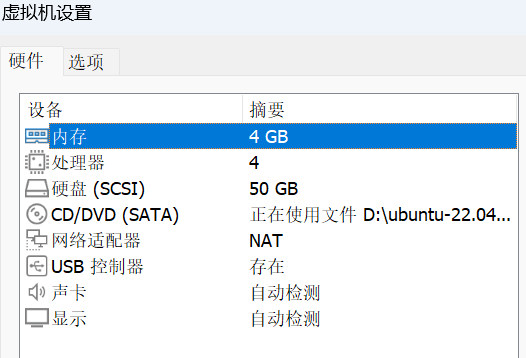
Linux内核版本：ubuntu 22.04.5  6.8.0-107-generic

SET十万条数据（写性能）       
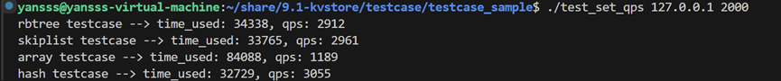

GET十万条数据（读性能）
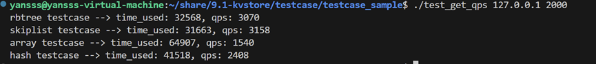

redis （写性能）

哈希：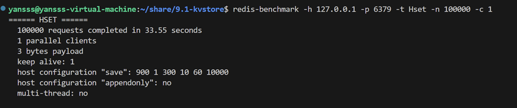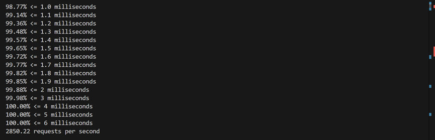

跳表：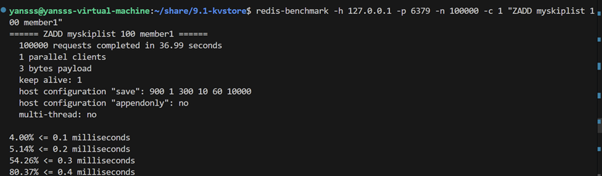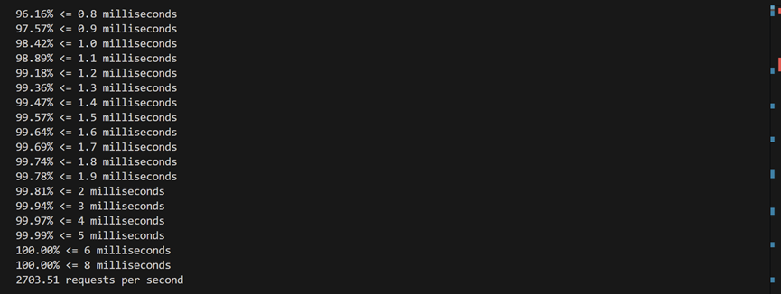

redis （读性能）
 
哈希：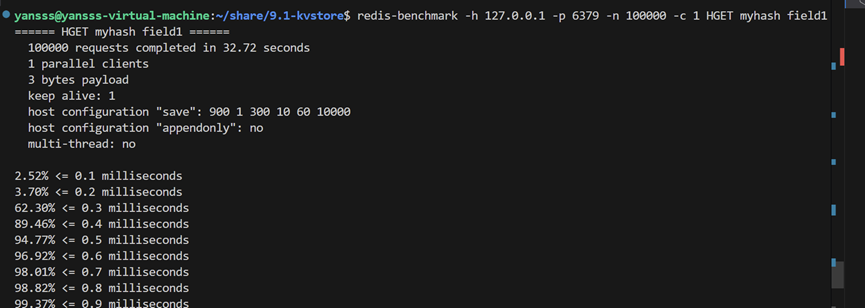 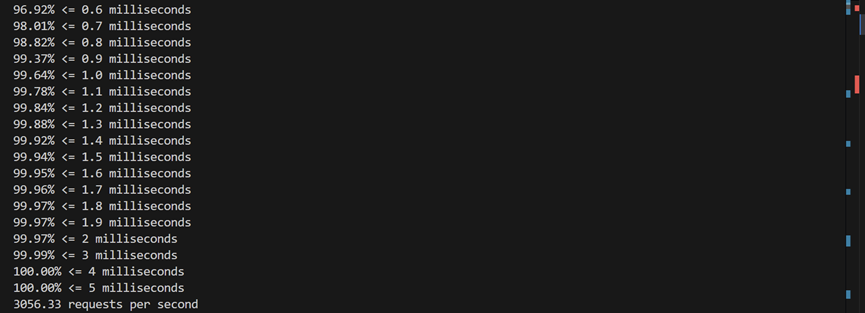

哈希：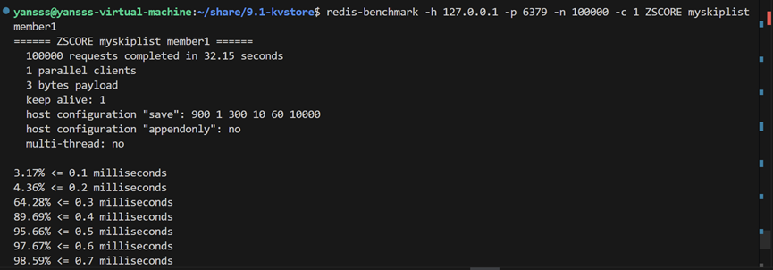 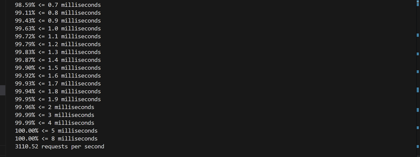


主从同步写性能：
SET十万条数据：
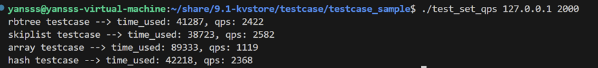
